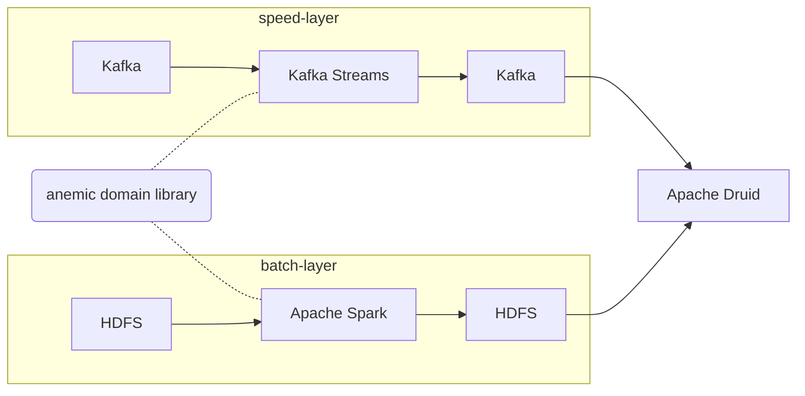
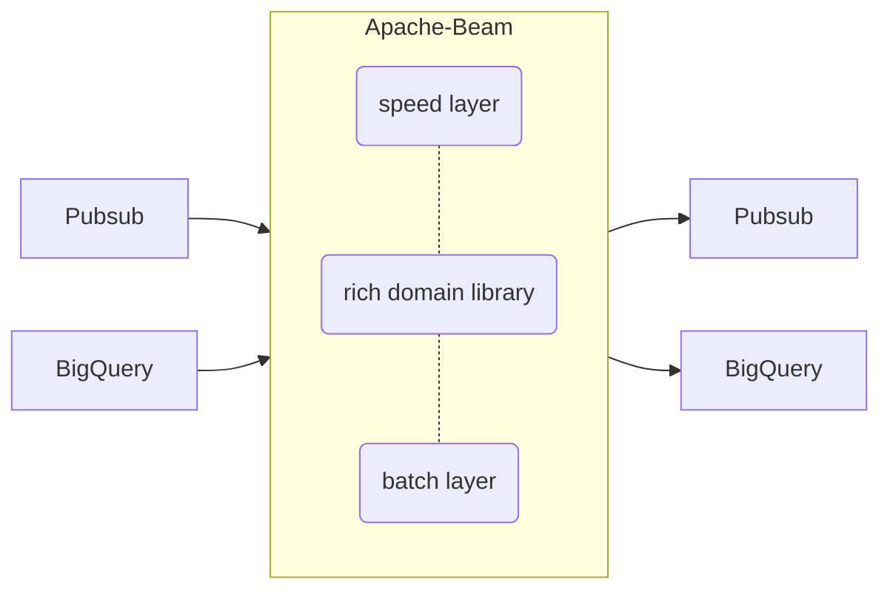
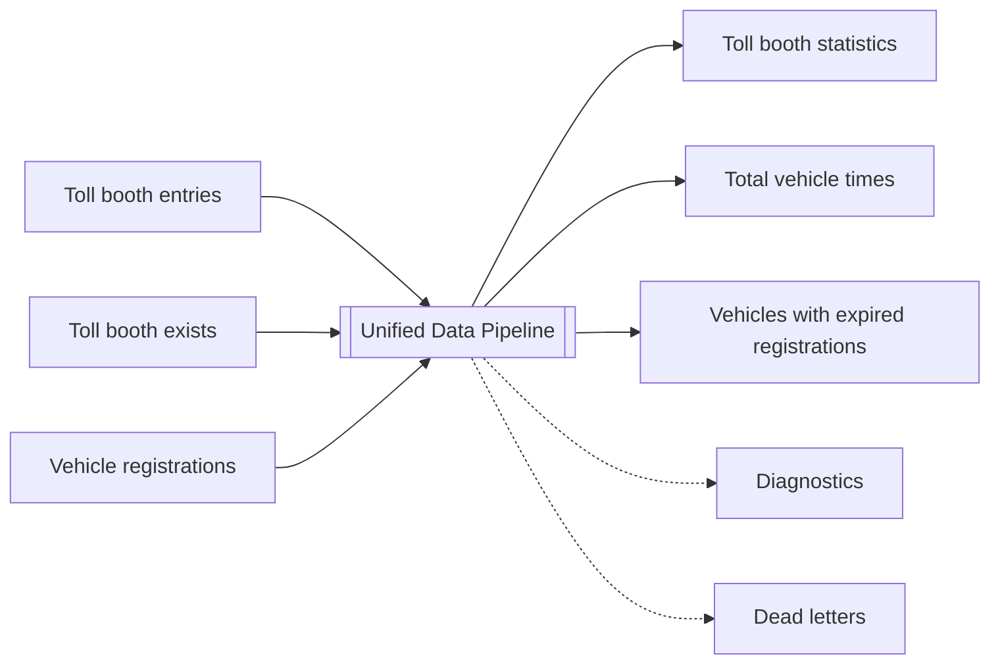
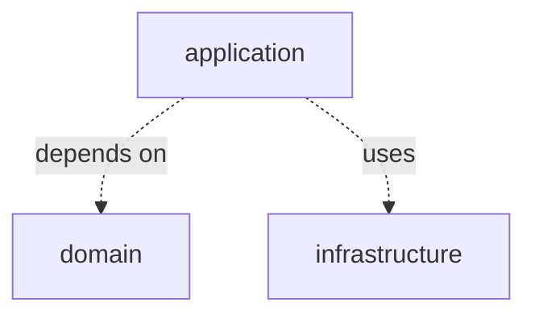

Unified batch and streaming processing is a data architecture that seamlessly combines both batch and real-time data processing.
It enables organizations to gain real-time insights from their data while maintaining the ability to process large volumes of historical data. In the past organizations often dealt with batch and streaming as separate data pipelines,
leading to increased complexity in data infrastructure and codebase management.

## Lambda architecture

Below you can find the lambda architecture of the clickstream data enrichment system I developed around 2017. If you have never heard about lambda architecture, see Nathan Marz article [How to beat the CAP theorem](http://nathanmarz.com/blog/how-to-beat-the-cap-theorem.html).



Real-time data pipeline (a.k.a speed layer) consumed an infinite stream of events from Kafka cluster, performed stateless or stateful transformations, and published results again to Kafka.
Batch data pipeline read complete partition of data from HDFS, performed transformations and wrote results again to HDFS.
Analytical databases like Apache Druid loaded real-time and batch results and acted as a serving layer for downstream consumers.

To reduce duplication I extracted part of domain logic into a shared library. Kafka Streams and Apache Spark used the library to apply common processing logic.

In practice, such system had the following design flaws:

* Kafka Streams and Apache Spark use different API for stateful operations like windowing and joining. 
I couldn't reuse the code between speed and batch layers beyond the stateless map/filter operations.

* Runtime environments for speed and batch layer were different. Kafka Streams run on Mesos cluster, Apache Spark on YARN. I couldn't reuse deployment automation, monitoring and alerting. 

* While Apache Spark was a mature data processing framework, Kafka Streams didn't meet my expectations. See my blog post [Kafka Streams DSL vs processor API](/blog/2017/11/02/kafka-streams-dsl-vs-processor-api/) from 2017 for details. 

## Unified architecture

In 2019 I moved from on-prem to Google Cloud Platform and have been developing data processing pipelines using Apache Beam. 
It's still a lambda architecture but realization is much better than in 2017.



If I compare the architecture to the architecture from 2017:

* Apache Beam allows to unify domain logic between batch and speed layers.
Stateful operations like regular, window and temporal joins are the same for streaming and batch.

* Runtime environments for real-time and batch are almost the same. 
I deploy all pipelines on Dataflow, managed service on Google Cloud Platform.

* Maturity of batch and streaming parts is similar.
For example, Dataflow provides external services for data shuffling in batch and streaming. Moving shuffling out of workers is critical for jobs scalability.

However, the unification doesn't mean that you can deploy exactly the same job in a streaming or in a batch manner. 
There are no magic parameters like `--batch` or `--streaming`, you have to build such capability yourself by proper design.
{: .notice--info}

## Data pipeline

Let's start with a simple use-case with unified batch and streaming business logic.
Data pipeline for calculating statistics from toll booths you encounter on highways, bridges, or tunnels.
I took inspiration from Azure documentation [Build an IoT solution by using Stream Analytics](https://learn.microsoft.com/en-us/azure/stream-analytics/stream-analytics-build-an-iot-solution-using-stream-analytics). 



### Inputs

Streaming pipeline subscribes for events emitted when vehicles cross toll booths.
On startup it reads the history of vehicle registrations and after start gets real-time updates. The command line could looks like this:

```
TollBoothStreamingJob \
    --boothEntrySubscription=... 
    --boothExitSubscription=...
    --vehicleRegistrationTable=...
    --vehicleRegistrationSubscription=...
```

Batch version of the same pipeline reads historical data from a data warehouse and
calculates results for a given date specified as `effeciveDate` parameter.

```
TollBoothBatchJob \
    --effectiveDate=2014-09-04
    --boothEntryTable=... 
    --boothExitTabel=...
    --vehicleRegistrationTable=...
```

### Outputs

Regardless of the source of data the pipeline calculates similar statistics, for example:

* Count the number of vehicles that enter a toll booth.
* Report total time for each vehicle

The streaming job aggregates results in short windows to achieve low latency.
It publishes statistics as streams of events for downstream real-time data pipelines.

```
TollBoothStreamingJob \
    --aggregationDuration=60 // seconds
    --boothEntryStatsTopic=...
    --totalVehicleTimeTopic=...
```

The batch job aggregates statistics in much larger windows to achieve better accuracy.
It writes results into a data warehouse for downstream batch data pipelines and reporting. 

```
TollBoothBacthJob \
    --boothEntryStatsTable=...
    --totalVehicleTimeTable=...
```

The streaming pipeline detects vehicles with expired registrations, it's more valuable than fraud detection in a daily batch. 

```
TollBoothStreamingJob \
    --vehiclesWithExpiredRegistrationTopic=...
```

### Diagnostics

Because the streaming pipeline is much harder to debug, it's crucial to put aside some diagnostic information about the current state of the job. 
For example if the job receives a toll booth entry message for a given vehicle, but it doesn't have information about this vehicle registration yet. 
This is a temporary situation if one stream of data is late and the job produces incomplete results. 

### Dead letters

If there is an error in the input data, the batch pipeline just fails. 
You could fix invalid data and execute a batch job again. 

On streaming pipelines single invalid record could block the whole pipeline forever.
When the streaming pipeline isn't able to process a message, put this message into Dead Letter Queue (DLQ). The invalid records could be fixed and processed again. 

## Domain, infrastructure and application layers

As you could see, the streaming and batch pipelines aren't the same. 
They have different inputs and outputs, use different parameters to achieve either lower latency or better accuracy.

How to organize the code to get unified architecture?
{: .notice--info}

Split the codebase into three layers:

* Domain with business logic, shared between streaming and batch
* Infrastructure with Input/Output
* Application to parse command line parameters and glue Domain and Infrastructure together



### Domain

Below you can find a function for calculating total time between vehicle entry and exit.
The function uses a session window to join vehicle entries and vehicle exits within a gap duration. 
When there is no exit for a given entry, the function can't calculate total time but emits diagnostic information.

The code uses [Spotify Scio](https://github.com/spotify/scio), excellent Scala API for [Apache Beam](https://github.com/apache/beam).

```scala
import org.joda.time.Duration
import com.spotify.scio.values.SCollection

def calculateInSessionWindow(
    boothEntries: SCollection[TollBoothEntry],
    boothExits: SCollection[TollBoothExit],
    gapDuration: Duration
): (SCollection[TotalVehicleTime], SCollection[TotalVehicleTimeDiagnostic]) = {
    val boothEntriesById = boothEntries
        .keyBy(entry => (entry.id, entry.licensePlate))
        .withSessionWindows(gapDuration)
    val boothExistsById = boothExits
        .keyBy(exit => (exit.id, exit.licensePlate))
        .withSessionWindows(gapDuration)

    val results = boothEntriesById
        .leftOuterJoin(boothExistsById)
        .values
        .map {
        case (boothEntry, Some(boothExit)) =>
            Right(toTotalVehicleTime(boothEntry, boothExit))
        case (boothEntry, None) =>
            Left(TotalVehicleTimeDiagnostic(boothEntry.id, TotalVehicleTimeDiagnostic.MissingTollBoothExit))
        }

    results.unzip
}

private def toTotalVehicleTime(boothEntry: TollBoothEntry, boothExit: TollBoothExit): TotalVehicleTime = {
    val diff = boothExit.exitTime.getMillis - boothEntry.entryTime.getMillis
    TotalVehicleTime(
        licensePlate = boothEntry.licensePlate,
        tollBoothId = boothEntry.id,
        entryTime = boothEntry.entryTime,
        exitTime = boothExit.exitTime,
        duration = Duration.millis(diff)
    )
}
```

The logic is exactly the same for the streaming and for the batch, there is no IO related code here. 
Streaming pipeline defines shorter window gap to get lower latency, 
batch pipeline longer gap for better accuracy.

Because this is a data processing code, don't expect a pure domain without external dependencies. Domain logic must depend on Apache Beam / Spotify Scio to make something useful.
{: .notice--info}


### Application

Application layer is a main differentiator between batch and streaming.

A slightly simplified version of the streaming pipeline might look like this:

```scala
def main(mainArgs: Array[String]): Unit = {
    val (sc, args) = ContextAndArgs(mainArgs)
    val config = TollStreamingJobConfig.parse(args)

    // subscribe toll booth entries and exits as JSON, put invalid messsages into DLQ
    val (boothEntryMessages, boothEntryMessagesDlq) =
      sc.subscribeJsonFromPubsub(config.entrySubscription)

    val (boothExitMessages, boothExitMessagesDlq) =
      sc.subscribeJsonFromPubsub(config.exitSubscription)

    // decode JSONs into domain objects, write invalid inputs to Cloud Storage
    val (boothEntries, boothEntriesDlq) = TollBoothEntry.decodeMessage(boothEntryMessages)  
    boothEntriesDlq
      .withFixedWindows(duration = TenMinutes)
      .writeUnboundedToStorageAsJson(config.entryDlq)

    val (boothExits, boothExistsDlq) = TollBoothExit.decodeMessage(boothExitMessages)
    boothExistsDlq
      .withFixedWindows(duration = TenMinutes)
      .writeUnboundedToStorageAsJson(config.exitDlq)   

    // calculate total vehicle times, write aggregated diagnostic to BigQuery
    val (totalVehicleTimes, totalVehicleTimesDiagnostic) =
      TotalVehicleTime.calculateInSessionWindow(boothEntries, boothExits, gapDuration = TenMinutes)

    totalVehicleTimesDiagnostic
      .sumByKeyInFixedWindow(windowDuration = TenMinutes)
      .writeUnboundedToBigQuery(config.totalVehicleTimeDiagnosticTable)
    
    // encode total vehicle times and writes into BigQuery, put invalid writes into DLQ
    val totalVehicleTimesDlq = TotalVehicleTime
      .encodeRecord(totalVehicleTimes)
      .writeUnboundedToBigQuery(config.totalVehicleTimeTable)

    // union all DLQ, aggregate and write to BigQuery
    val ioDiagnostics = IoDiagnostic.union(
      boothEntryMessagesDlq,
      boothExitMessagesDlq,
      totalVehicleTimesDlq
    )
    ioDiagnostics
      .sumByKeyInFixedWindow(windowDuration = TenMinutes)
      .writeUnboundedToBigQuery(config.diagnosticTable)

    // run the pipeline
    sc.run()
}
``` 

The corresponding batch pipeline looks like this:

```scala
def main(mainArgs: Array[String]): Unit = {
    val (sc, args) = ContextAndArgs(mainArgs)

    val config = TollBatchJobConfig.parse(args)

    // read toll booth entries and toll booth exists from BigQuery partition
    val boothEntryRecords = sc.readFromBigQuery(
        config.entryTable,
        StorageReadConfiguration().withRowRestriction(
            RowRestriction.TimestampColumnRestriction("entry_time", config.effectiveDate)
        )
    )

    val boothExitRecords = sc.readFromBigQuery(
      config.exitTable,
      StorageReadConfiguration().withRowRestriction(
        RowRestriction.TimestampColumnRestriction("exit_time", config.effectiveDate)
      )
    )

    // decode BigQuery like objects into domain objects
    val boothEntries = TollBoothEntry.decodeRecord(boothEntryRecords)
    val boothExits = TollBoothExit.decodeRecord(boothExitRecords)

    // calculate total vehicle times, write aggregated diagnostic to BigQuery
    val (totalVehicleTimes, totalVehicleTimesDiagnostic) =
      TotalVehicleTime.calculateInSessionWindow(boothEntries, boothExits, gapDuration = OneHour)

    totalVehicleTimesDiagnostic
      .sumByKeyInFixedWindow(windowDuration = OneDay)
      .writeBoundedToBigQuery(config.totalVehicleTimeDiagnosticOneHourGapTable)

    // encode total vehicle times and writes into BigQuery
    TotalVehicleTime
      .encodeRecord(totalVehicleTimes)
      .writeBoundedToBigQuery(config.totalVehicleTimeOneHourGapPartition)

    // run the pipeline
    sc.run()
}
```

Upon initial glance streaming and batch pipelines look like a duplicated code which violates DRY principle (Don't Repeat Yourself). Where's batch and streaming unification?

Don't worry, there is nothing wrong with such design:

* Application layer should use Descriptive and Meaningful Phrases (DAMP principle) over DRY
* Configuration is different, see properties of `TollBatchJobConfig` and `TollStreamingJobConfig`
* Inputs are different, Pubsub subscriptions for streaming and BigQuery tables for batch
* Outputs with total vehicle times aggregated within different session gaps, don't mix datasets of different accuracy in a single table
* Error handling for streaming is much more complex than for batch

### Infrastructure

Where's the infrastructure in the presented code samples?
Because of Scala syntax powered by some implicit conversions it's hard to spot.

Infrastructure layer provides all the functions below in a fully generic way.
Extract infrastructure module as a shared library and use in all data pipelines.

* `subscribeJsonFromPubsub` - for subscribing to JSON messages on Pubsub
* `readFromBigQuery` - for reading from BigQuery using Storage Read API
* `queryFromBigQuery` - for querying BigQuery using SQL
* `writeUnboundedToBigQuery` - for writing to BigQuery using Storage Write API
* `writeBoundedToBigQuery` - for writing to BigQuery using File Loads
* `publishJsonToPubsub` - for publishing JSON messages on Pubsub
* `writeUnboundedToStorageAsJson` - for writing JSON files on Cloud Storage

## Summary

Unified batch and streaming doesn't mean that you can execute exactly the same code in a batch or streaming fashion. 
It doesn't work this way, streaming pipelines favor lower latency, batch is for better accuracy.

* Organize your codebase into domain, application and infrastructure layers.
* Keep business logic in domain layer and make it fully reusable between batch and streaming
* Invest into reusable infrastructure layer with high quality IO connectors
* Keep application layer descriptive and delegate complex tasks to domain and infrastructure layers

I take all code samples from [https://github.com/mkuthan/stream-processing/](https://github.com/mkuthan/stream-processing/) repository, my playground for stream processing.
If you find something interesting but foggy, just let me know.
I will be glad to blog something more about stream processing.