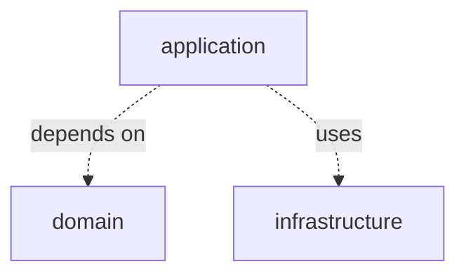

In 2015 I blogged how to test [Spark and Spark Streaming](/blog/2015/03/01/spark-unit-testing/) data pipelines.
Today, I'm not fully agree with myself from the past because the context has changed, the tools are more mature and data pipelines are more complex.
However, I still think that capabilities for automated testing are one of the most important elements of modern data processing frameworks.

This blog post gathers many automated and semi-automated testing practices I use on daily basis for developing [unified batch and streaming](/blog/2023/09/27/unified-batch-streaming/) data pipelines deployed on Google Cloud Platform (GCP):

* Codebase organization for testability
* How to prepare test data in a programmatic and reusable way?
* Business logic tests on local runner
* How to test out-of-order or late data?
* Tests for the whole pipelines with stubbed sources and sinks
* Integration tests for cloud based services like BigQuery, Pubsub or Cloud Storage
* When to use property-based testing?
* Data correctness verification using production data
* Performance testing, especially for the streaming pipelines
* Cloud cost efficiency analysis after major changes

All presented code examples use [Apache Beam](https://github.com/apache/beam) and [Spotify Scio](https://github.com/spotify/scio), but general rules are portable to other data processing framework like [Apache Flink](https://flink.apache.org) or [Apache Spark](https://flink.apache.org).
Or use Apache Beam / Spotify Scio API to develop data pipelines and run them on Flink, Spark or any other supported [runner](https://beam.apache.org/documentation/runners/capability-matrix/).

## Codebase organization

Split the codebase into three layers:

* Domain with business logic, heavily tested using local Apache Beam runner (a.k.a direct runner)
* Infrastructure with sources and sinks (I/0), tested within real cloud resources like BigQuery, Cloud Storage or Pubsub
* Application that glue Domain and Infrastructure together, covered by end2end tests with stubbed IO

If you mix domain with infrastructure you will get hard to develop and slow test suite.
Or tests won't cover all required business scenarios because they're too expensive to write.
If you skip application layer tests, you will end up with the pipeline which doesn't work as a whole.
Tests on every single layer have their own purpose and should test different aspect of data pipeline.

## Test data

How to prepare test data?

## Domain layer

Tests for domain layer check that data transformations keep accuracy and integrity preventing errors in critical business processes.

Core characteristic:

* Test business scenarios in isolation, inputs and outputs are always [PCollections](https://beam.apache.org/documentation/programming-guide/#pcollections) or [SCollections](https://spotify.github.io/scio/api/com/spotify/scio/values/SCollection.html).
* Focus on small and independent functions
* For more complex data pipelines cover larger parts as well
* For complex data pipelines it should be the largest group of tests
* Execute early and often
* Execute in parallel

Simple examples

Complex streaming examples (out of order or late data)

## Application layer

Tests that cover everything, from parsing command line arguments by reading stubbed data, apply all transformations and assert results.

Core characteristic:

* Simulate command line arguments and call your main method
* Cover single happy path scenario or a few most important scenarios at most
* Use stub instead of real sources
* Assert on sinks instead writing to real databases
* Execute early and often

Batch and streaming examples

## Infrastructure layer

Infrastructure layer tests check if data pipeline is able to read from or write to various cloud resources.

Core characteristic:

* Always tests within real cloud resources
* Setup and teardown cloud resources programmatically
* Use separate cloud resources for each test scenario
* Check error handling, for example try to write out of range timestamp or number to BigQuery
* Run automatically after push on CI
* Use scheduled execution to check that your infrastructure layer is still compatible with the current version of cloud resources
* Execute in parallel but check cloud quotas first

Examples

## Property based testing

JSON serialization and de-serialization example
Writing to BigQuery example

## Data correctness

Feature branch run on PRE-PROD with production data, compare results between PRE-PROD and PROD environment

## Performance testing

Feature branch run on PRE-PROD with production data, check metrics and profiler

## Cost efficiency

Link to [FinOps for data pipelines on GCP](https://mkuthan.github.io/blog/2022/04/02/gcp-finops/)

## Summary

Key takeaways
