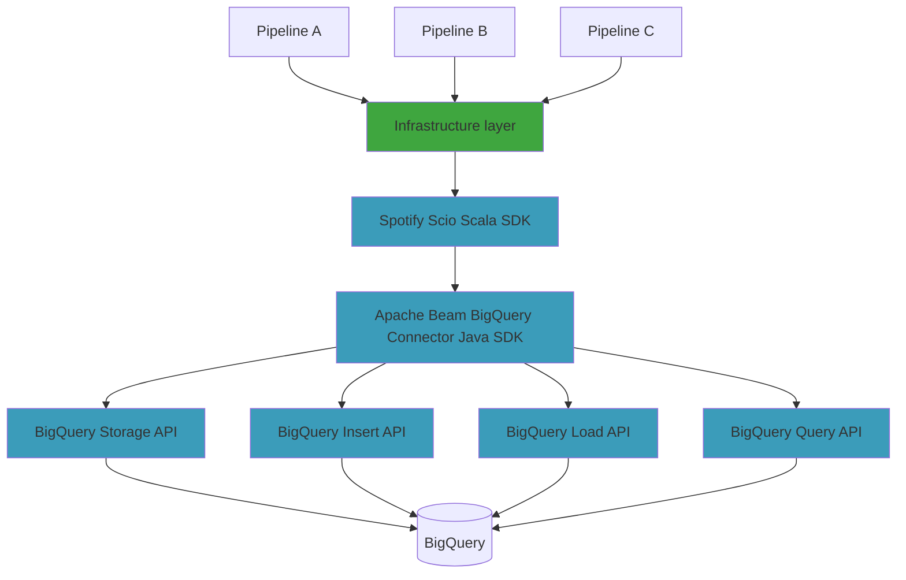

In Domain-Driven Design (DDD), the infrastructure layer is responsible for managing the interactions between the domain layer and the external systems like databases, message queues, and other systems.
Here are the key characteristics of the infrastructure layer in DDD architecture in the context of unified batch and streaming data pipelines:

* **Technical Concerns**: The infrastructure layer is primarily focused on addressing technical concerns like data access and communication with external systems.
* **High Quality API**: Should give seamless and error-resistant way to interact with external resources while minimizing ambiguities.
* **Performance and Scalability**: Infrastructure components often include mechanisms for optimizing throughput for batch, or minimize latency for streaming.
* **Data Integrity**: Infrastructure components use integration tests with real external services to verify that the layer correctly handles data storage and retrieval.
* **Error Handling**: The infrastructure layer handles errors gracefully and provides appropriate feedback or recovery mechanisms.
* **Testing and Stubbing**: Infrastructure components must include facilities for  testing, stubbing, and simulating external dependencies to isolate and test the domain logic without needing a full infrastructure setup.

How to deliver infrastructure layer for unified batch and streaming data pipelines?


## Architecture

As you may be aware from my earlier [blog posts](/tags/#apache-beam),
my daily technology stack predominantly comprises
[Apache Beam](https://github.com/apache/beam) and
[Spotify Scio](https://github.com/spotify/scio).
I deploy batch and streaming data pipelines on Dataflow runner, managed service on Google Cloud Platform.
The pipelines communicate with cloud resources, where BigQuery plays the major role.
Look at the overall architecture,
this blog post focuses on the infrastructure layer
but I will also refer to Spotify Scio, Apache Beam and underlying BigQuery APIs.



## Apache Beam BigQuery Connector

Apache Beam BigQuery Connector delivers all required functionalities to read and write from/to BigQuery in batch and streaming data pipelines.
Every time I need to debug some issue and dive into [source code](https://github.com/apache/beam/tree/master/sdks/java/io/google-cloud-platform/src/main/java/org/apache/beam/sdk/io/gcp/bigquery),
I feel lucky that I didn't have to implement connector myself.

### Too many BigQuery APIs

All Apache Beam built-in connectors use [builder pattern](https://en.wikipedia.org/wiki/Builder_pattern) to configure I/O.
It's an object oriented design pattern for creating complex objects step by step.
For example, to write to BigQuery, you need to create a `BigQueryIO.Wite` object and configure it with a table name, writing method, number of shards, and create/write dispositions.

```java
BigQueryIO.Write write = BigQueryIO.write()
    .to("project:dataset.table")
    .withMethod(Method.FILE_LOADS)
    .withNumFileShards(3)
    .withCreateDisposition(CreateDisposition.CREATE_IF_NEEDED)
    .withWriteDisposition(WriteDisposition.WRITE_APPEND)
```

Builder pattern might be a good solution for configuring relatively simple I/O connectors but BigQuery connector is far from simplicity.
Below is the list of methods in `BigQueryIO.Write` builder class and the list only grows:

1. `ignoreInsertIds()`
1. `ignoreUnknownValues()`
1. `optimizedWrites()`
1. `skipInvalidRows()`
1. `useAvroLogicalTypes()`
1. `useBeamSchema()`
1. `withAutoSchemaUpdate(boolean autoSchemaUpdate)`
1. `withAutoSharding()`
1. `withAvroWriter(SerializableFunction<Schema,DatumWriter<T>> writerFactory)`
1. `withClustering(Clustering clustering)`
1. `withCreateDisposition(BigQueryIO.Write.CreateDisposition createDisposition)`
1. `withCustomGcsTempLocation(ValueProvider<j.l.String> customGcsTempLocation)`
1. `withExtendedErrorInfo()`
1. `withFailedInsertRetryPolicy(InsertRetryPolicy retryPolicy)`
1. `withJsonSchema(j.l.String jsonSchema)`
1. `withKmsKey(j.l.String kmsKey)`
1. `withLoadJobProjectId(j.l.String loadJobProjectId)`
1. `withMaxBytesPerPartition(long maxBytesPerPartition)`
1. `withMaxFilesPerBundle(int maxFilesPerBundle)`
1. `withMaxRetryJobs(int maxRetryJobs)`
1. `withMethod(BigQueryIO.Write.Method method)`
1. `withNumFileShards(int numFileShards)`
1. `withNumStorageWriteApiStreams(int numStorageWriteApiStreams)`
1. `withoutValidation()`
1. `withSchema(TableSchema schema)`
1. `withSchemaUpdateOptions(j.u.Set<BigQueryIO.Write.SchemaUpdateOption> schemaUpdateOptions)`
1. `withSuccessfulInsertsPropagation(boolean propagateSuccessful)`
1. `withTableDescription(j.l.String tableDescription)`
1. `withTimePartitioning(TimePartitioning partitioning)`
1. `withTriggeringFrequency(Duration triggeringFrequency)`
1. `withWriteDisposition(BigQueryIO.Write.WriteDisposition writeDisposition)`
1. `withWriteTempDataset(j.l.String writeTempDataset)`

Why there are so many knobs?

Because the connector supports
[BigQuery Storage Write API](https://cloud.google.com/bigquery/docs/write-api),
[BigQuery Batch Loads API](https://cloud.google.com/bigquery/docs/batch-loading-data),
[BigQuery Insert API](https://cloud.google.com/bigquery/docs/streaming-data-into-bigquery)
for writing, and
[BigQuery Storage Read API](https://cloud.google.com/bigquery/docs/reference/storage/),
[BigQuery Query API](https://cloud.google.com/bigquery/docs/reference/rest/v2/jobs/query)
for reading.

* **Some configuration options are relevant for a single API**: This means that certain configuration settings are specific to a particular part of the API. For example, options like `withAutoSchemaUpdate` or `withNumStorageWriteApiStreams` are only applicable when working with the BigQuery Storage API.
* **Some configurations are heavily dependent**: This indicates that some settings rely on each other. For instance, when you are using the `FILE_LOADS` method to write an unbounded `PCollection`, you must provide both `withTriggeringFrequency` and `withNumFileShards` configurations for the process to work correctly.
* **Some combinations don't make any sense**: In some cases, certain combinations of configuration options are incompatible or illogical. For example, using `withCreateDisposition(CREATE_NEVER)` along with `withClustering` or `withTimePartitioning` may not be meaningful or may cause issues.
* **You can easily make a mistake and configure the connector incorrectly**: This suggests that because of the complexity of configuration options and their inter-dependencies, it's easy to make mistakes when setting up the API, which can lead to errors or unexpected behavior.
* **The only way to find out is to run the pipeline and wait for the error**: In this context, it means that the only practical way to discover if you've configured the API correctly or not is to execute the data processing pipeline and monitor it for any errors or issues that may arise during runtime.

### Lack of type safety, limited testability

Another limitation of the connector API is a requirement that you have to explicitly implement converters between domain types and BigQuery [TableRow](https://www.javadoc.io/static/com.google.apis/google-api-services-bigquery/v2-rev20230520-2.0.0/com/google/api/services/bigquery/model/TableRow.html) or [SchemaAndRecord](https://beam.apache.org/releases/javadoc/current/org/apache/beam/sdk/io/gcp/bigquery/SchemaAndRecord.html).
Everything without any help from the compiler.

Reading example with manual conversion from `org.apache.beam.sdk.io.gcp.bigquery.SchemaAndRecord` into domain type `WeatherRecord`:

```java
PCollection<WeatherRecord> weatherData = pipeline.apply(
    BigQueryIO
      .read(new SerializableFunction<SchemaAndRecord, WeatherRecord>() {
        public WeatherRecord apply(SchemaAndRecord schemaAndRecord) {
          GenericRecord record =schemaAndRecord.getRecord();
          return new WeatherRecord(
            record.get("field1"), 
            record.get("field2")
          )
        }
      })
      .from("samples.weather_stations"))
```

Writing example with manual conversion from domain type `Quote` to `com.google.api.services.bigquery.model.TableRow`:

```java
PCollection<Quote> quotes = ...;

quotes.apply(BigQueryIO.write()
    .withFormatFunction(
      quote -> new TableRow()
        .set("field1", quote.getField1())
        .set("field2", quote.getField2())
    )
    .to("samples.quotes"))
```

It also makes your code less convenient to test, since you have to deal with low-level types instead of your own domain types. To stub BigQuery during testing, you need to create `org.apache.beam.sdk.io.gcp.bigquery.SchemaAndRecord` or `com.google.api.services.bigquery.model.TableRow`.

## Spotify Scio

Scio is a Scala API for Apache Beam and Google Cloud Dataflow inspired by Apache Spark and Scalding.
One of the most important feature of Spotify Scio is a type-safe BigQuery API.
Scio generates converters between Scala case classes and `TableRow` at compile time without runtime penalty of reflection.
If you try to use unsupported type, for example `BigInt` the code doesn't compile.

For example, define domain type as a case class with `BigQueryType.toTable` annotation. This annotation enables Scio magic macros to generate necessary converters.

```scala
object TollBoothEntry {
  @BigQueryType.toTable
  final case class Record(
      id: String,
      entry_time: Instant,
      license_plate: String,
      state: String,
      make: String,
      model: String,
      vehicle_type: String,
      weight_type: String,
      toll: BigDecimal,
      tag: String
  )
}
```

Read `TollBoothEntry.Record` from BigQuery using Storage Read API:

```scala
val tollBoothEntries: SCollection[TollBoothEntry.Record] =
    sc.typedBigQueryStorage("samples.toll_booth_entries")
```

Write `TollBoothEntry.Record` to BigQuery using Storage Write API:

```scala
val tollBoothEntries: SCollection[TollBoothEntry.Record] = ...
tollBoothEntries.saveAsTypedBigQueryTable(Table("samples.toll_booth_entries"))
```

### Too many knobs

Unfortunately Scio design follows generic Apache Beam approach for connector API design.
Look at the `saveAsTypedBigQueryTable` method signature, again you get matrix of all available knobs plus `configOverride` to override even more parameters using Apache Beam API:

```scala
def saveAsTypedBigQueryTable(
    table: Table,
    timePartitioning: TimePartitioning = TableWriteParam.DefaultTimePartitioning,
    writeDisposition: WriteDisposition = TableWriteParam.DefaultWriteDisposition,
    createDisposition: CreateDisposition = TableWriteParam.DefaultCreateDisposition,
    clustering: Clustering = TableWriteParam.DefaultClustering,
    method: Method = TableWriteParam.DefaultMethod,
    triggeringFrequency: Duration = TableWriteParam.DefaultTriggeringFrequency,
    sharding: Sharding = TableWriteParam.DefaultSharding,
    failedInsertRetryPolicy: InsertRetryPolicy = TableWriteParam.DefaultFailedInsertRetryPolicy,
    configOverride: TableWriteParam.ConfigOverride[T] = TableWriteParam.defaultConfigOverride
)
```

### Limited testability

Another disadvantage is a limited support for testing.
To develop entire pipeline test (a.k.a job test) you have to provide stubs for input data, expectations for output data using IO identifiers.

* Methods like `typedBigQueryStorage` and `saveAsTypedBigQueryTable` don't expose IO identifier explicitly. The identifier is calculated internally based on table name and it makes tests harder to setup.
* Even though that Scio generates `TableRow` converters automatically, in tests you have to play with low level type `TableRow` instead of your domain types. See the example test below:

```scala
class BigQueryTornadoesTest extends PipelineSpec {
  val inData: Seq[TableRow] = Seq(
    (1, true),
    (1, false),
    (2, false),
    (3, true),
    (4, true),
    (4, true)
  ).map(t => TableRow("month" -> t._1, "tornado" -> t._2))

  val expected: Seq[TableRow] = Seq((1, 1), (3, 1), (4, 2))
    .map(t => TableRow("month" -> t._1, "tornado_count" -> t._2))

  "BigQueryTornadoes" should "work" in {
    JobTest[com.spotify.scio.examples.cookbook.BigQueryTornadoes.type]
      .args("--input=bigquery-public-data:samples.gsod", "--output=dataset.table")
      .input(BigQueryIO("bigquery-public-data:samples.gsod"), inData)
      .output(BigQueryIO[TableRow]("dataset.table")) { coll =>
        coll should containInAnyOrder(expected)
      }
      .run()
  }
}
```

## Design patters for implementing infrastructure layer

Before I present my design of the infrastructure layer API, I would like to show you Algebraic Data Types (ADT) and Phantom Types design patterns first.

### Algebraic Data Types

ADT is a concept in computer science and programming languages that describe data types by combining other data types in various ways.
There are two main types of ADTs:

**Sum Types (Disjoint Union)**: Sum types allow you to create a data type that can have one of several possible values. This is similar to a union or a tagged union in some other languages. The values in a sum type are mutually exclusive.
For example a simple sum type to define selected fields for Storage Read API.
You can select either list of fields or `NoFields`.

```scala
sealed trait SelectedFields

object SelectedFields {
  case object NoFields extends SelectedFields
  final case class NamedFields(fields: List[String]) extends SelectedFields
}
```

Similar sum type for Storage Read API row restriction, you can either define restriction as SQL or `NoRestriction`.

```scala
sealed trait RowRestriction

object RowRestriction {
  case object NoRestriction extends RowRestriction
  final case class SqlRestriction(sql: String) extends RowRestriction
}
```

**Product Types**: Product types allow you to combine multiple values into a single value, similar to a struct or record in some languages.
A product type can hold several values of different data types.
For example a simple product type to define Storage Read API configuration:

```scala
case class StorageReadConfiguration(
  rowRestriction: RowRestriction,
  selectedFields: SelectedFields
)
```

### Phantom types

Yet another useful design pattern for implementing infrastructure layer API are phantom types.
They help to catch type-related errors at compile-time, providing strong guarantees about the correctness of the code.
For example instead of using `String` to reference BigQuery tables define the following type:

```scala
case class BigQueryTable[T](id: String)

val tollBoothEntryTable = BigQueryTable[TollBoothEntry]("sample.toll_booth_entries")
val tollBoothExitTable = BigQueryTable[TollBoothExit]("sample.toll_booth_exits")
```

In this example, `BigQueryTable` is a parametrized type, and the type parameter `T` is used solely as a marker to distinguish different instances of `BigQueryTable` at the type level.
There is no runtime difference between `tollBoothEntryTable` and `tollBoothExitTable`, but the type parameter helps in making sure that the correct types are used in the right places and provides additional compile-time safety.
With such design the compiler complains if you try to read `TollBoothExit` records from `sample.toll_booth_entries` table.

## Opinionated infrastructure layer API

Armed with [#algebraic-data-types](Algebraic Data Types), [#phantom-types](Phantom Types) and knowing Apache Beam ans Spotify Scio disadvantages, let's design better API for infrastructure layer.
Deliver the following BigQuery connector features keeping the non-functional requirements in mind:

* Query using BigQuery jobs to fetch data with complex SQL queries.
The query jobs are extremely powerful with complex joins, aggregations but limited in testing.
* Read the table using Storage Read API if simple filtering and projection capabilities are enough.
I always prefer this API over SQL queries as it's easier to test.
* Write-truncate bounded collections of data into given partition using Batch Loads API.
This writing method optimizes for throughput required by batch pipelines.
* Write-append unbounded collections of data into given table using Storage Write API
This writing method optimizes for latency required by streaming pipelines.

Look at [Test Driven Development for Data Engineers](/blog/2023/11/02/tdd-for-de/) blog post to see how to test data pipelines with such infrastructure layer API.
{: .notice--info}

### SQL Query

The method takes parametrized `id`, `query` and returns collection of BigQuery records de-serialized as domain objects of type `T`.

* `IoIdenfitier` enables automated testing, you can stub the input using the identifier
* `BigQueryQuery` is a parametrized value class for SQL query
* `ExportConfiguration` is a configuration crafted only for Beam [BigQueryIO.TypedRead.Method.html#EXPORT](https://beam.apache.org/releases/javadoc/current/org/apache/beam/sdk/io/gcp/bigquery/BigQueryIO.TypedRead.Method.html#EXPORT).

```scala
def queryFromBigQuery[T](
  id: IoIdentifier[T],
  query: BigQueryQuery[T],
  configuration: ExportConfiguration = ExportConfiguration() // recommended defaults
): SCollection[T]
```

Example usage, look that `ioIdentifier`, `query` and `results` types match together.

```scala
val effectiveDate = LocalDate.parse(args.required("effectiveDate"))

val ioIdentifier = IoIdentifier[TollBoothEntry.Record]("toll.booth_entry")
val query = BigQueryQuery[TollBoothEntry.Record](
  s"SELECT * FROM toll.booth_entry WHERE _PARTITION_TIME = $effectiveDate"
)

val results = sc.queryFromBigQuery(ioIdentifier, query)
```

### Read

API:

```scala
def readFromBigQuery[T](
  id: IoIdentifier[T],
  table: BigQueryTable[T],
  configuration: StorageReadConfiguration = StorageReadConfiguration() // recommended defaults
): SCollection[T]
```

Example:

```scala
val effectiveDate = LocalDate.parse(args.required("effectiveDate"))

val ioIdentifier = IoIdentifier[TollBoothEntry.Record]("toll.booth_entry")
val table = BigQueryTable[TollBoothEntry.Record](args.required("entryTable")),
val rowRestriction = RowRestriction.SqlRestriction(s"_PARTITION_TIME = $effectiveDate")

val results = sc.readFromBigQuery(
  ioIdentifier,
  table,
  StorageReadConfiguration().withRowRestriction(rowRestriction)
)
```

### Write-truncate bounded collections

API:

```scala
def writeBoundedToBigQuery(
  id: IoIdentifier[T],
  partition: BigQueryPartition[T],
  configuration: FileLoadsConfiguration = FileLoadsConfiguration() // recommended defaults
): Unit
```

Example:

```scala
val effectiveDate = LocalDate.parse(args.required("effectiveDate"))

val ioIdentifier = IoIdentifier[TollBoothStats.Record]("toll.booth_stats_daily")
val partition = BigQueryPartition
  .daily[TollBoothStats.Record]("toll.booth_stats_daily", localDate)

val tollBoothStats: SCollection[TollBoothStats.Record] = ...

tollBoothEntries.writeBoundedToBigQuery(
  ioIdentifier,
  partition
)
```

### Write-append unbounded collections

API:

```scala
def writeUnboundedToBigQuery(
    id: IoIdentifier[T],
    table: BigQueryTable[T],
    configuration: StorageWriteConfiguration = StorageWriteConfiguration() // recommended defaults
): SCollection[BigQueryDeadLetter[T]]
```

Example:

```scala
val ioIdentifier = IoIdentifier[TollBoothStats.Record]("toll.booth_stats_realtime")
val table = BigQueryTable[TollBoothStats.Record]("toll.booth_stats_realtime")

val tollBoothStats: SCollection[TollBoothStats.Record] = ...
tollBoothEntries.writeUnboundedToBigQuery(
  ioIdentifier,
  table
)
```

## Summary

The most generic and reusable API isn't always the best choice.