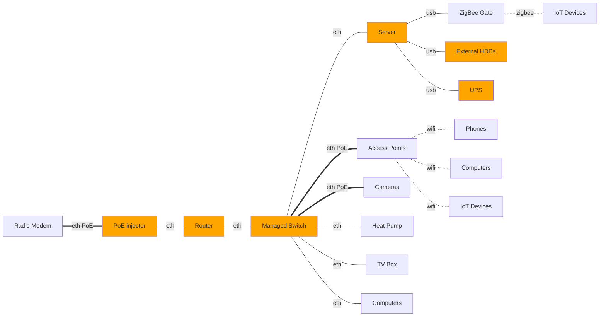

Welcome, fellow tech enthusiast! 🚀 If you’re anything like me, you’ve probably dreamed of having your own little corner of the digital universe—a place where wires hum, servers whir, and blinking LEDs create a symphony of possibilities. Well, my friend, you’re about to embark on an exciting adventure as we dive headfirst into the world of homelabs.

## Why a Homelab?

Before we delve into the nitty-gritty details of hardware, software, and network configurations, let’s take a moment to ponder why homelabs matter. Imagine having a playground where you can experiment, learn, and tinker without any constraints. Whether you’re a seasoned sysadmin, a budding developer, or just someone who loves gadgets, a homelab provides the canvas for your digital masterpiece.

### The Hardware Chronicles

Our journey begins with the tangible, the hardware that forms your homelab. Picture this: a sleek gateway guarding the entrance, a managed switch orchestrating data flows, access points spreading Wi-Fi magic, a sturdy rack shelf cradling your servers, and a trusty UPS ensuring uptime even during power outages. Oh, and let’s not forget the ZigBee—because who doesn’t love a touch of automation?

In this first installment, we’ll explore each piece of hardware, demystifying their roles and unraveling the magic behind their blinking lights. From choosing the right server to optimizing cable management, we’ve got you covered.

### Stay Tuned

So, grab your favorite mug of coffee (or tea, if that’s your jam), find a cozy spot, and join me as we venture into the heart of homelab creation. In the next post, we’ll fire up our Proxmox hypervisor, spin up some virtual machines, and explore the software side of things. Spoiler alert: Home Assistant is waiting in the wings!

Remember, this isn’t just about hardware—it’s about building a playground where curiosity reigns supreme. Buckle up, my friend; the homelab adventure awaits! 🌟

## Vision and Initial Requirements

When I started building my first homelab, I needed some vision and initial requirements to avoid costly mistakes. I meticulously researched hardware options, software configurations, and scalability considerations. As I laid the foundation for my homelab, I envisioned a versatile environment that would serve both my personal projects and professional development. This foresight allowed me to make informed decisions, optimize my setup, and create a robust infrastructure that continues to evolve.

### Network

* Centrally managed network devices to avoid manual and repetitive tasks.
* Dedicated network devices, networks must work if the server is down.
* [Category 6 ethernet cables](https://en.wikipedia.org/wiki/Category_6_cable), to allow easily upgrades up to [10GBASE-T](https://en.wikipedia.org/wiki/10_Gigabit_Ethernet#10GBASE-T).
* [Gigabit ethernet](https://en.wikipedia.org/wiki/Gigabit_Ethernet#1000BASE-T) network devices to strike a balance between performance and affordability.
* [Wi-Fi 802.11ax](https://en.wikipedia.org/wiki/Wi-Fi_6) to utilize Gigabit network. [Mesh technology](https://en.wikipedia.org/wiki/Wireless_mesh_network) to extend coverage by creating a seamless network across my home and surroundings.
* [Power over Ethernet](https://en.wikipedia.org/wiki/Power_over_Ethernet) to simplify the deployment of Wi-Fi access points, IP cameras, and other network devices. With PoE, you can transmit both data and power over a single Ethernet cable, eliminating the need for separate power sources.

### Server

* Power efficient to keep electricity costs under control.
* Multi-core CPU with high clock speeds and enough memory to handle all my virtual machines.
* GPU for hardware accelerated vision inference.
* NVMe SSD disk for OS hosting to get lightning-fast read and write speeds.
* Enterprise grade SATA disk for virtual machines to achieve reliability, durability, consistent performance, and avoid quick disk wear.
* USB3 to connect external HDD storage for camera recordings and backups.

### Cameras

* IP cameras with [RTSP](https://en.wikipedia.org/wiki/Real-Time_Streaming_Protocol) for wide compatibility with various recording and monitoring systems.
* Can operate without internet access. The last thing I would want is for the cameras to have access to the internet.
* Decent image quality. Fixed length, 8Mpx/4Mpx with at least 1/3 CMOS image sensor.
* IR illumination to get night vision.
* H.265 codec to get better video quality at given bitrate compared to older codes like H.264.
* Minimal “Smart” features. Rely on open-source software for recording and detection, and avoid paying extra for features like facial recognition or cloud-based analytics.

### IoT

* Don't overengineer smart home, everything should enhance the user experience, not complicate it. Essential functionalities must work if the server is down.
* Base on [ZigBee](https://en.wikipedia.org/wiki/Zigbee) mesh network, to avoid vendor specific Wi-Fi solutions.
* Wi-Fi devices only if there are no ZigBee viable alternatives. They have to work in a local network without cloud access and integrate well with Home Assistant.

### Other parts

* 19'' rack as organized space for mounting your network equipment, servers, and other devices.
* Patch panel for neatly organized Ethernet cables. It allows me to connect devices to the network without messy cable runs.
* Small UPS (Uninterruptible Power Supply) to ensure uninterrupted power supply during short electricity outages or fluctuations. Compatible with open-source software for monitoring and control.

## Big picture

I initiated the setup of my Homelab by meticulously planning the computer network, but the end result resembled a tangle of cables emerging from the walls in the utility room.

Below, you can observe the current state of the network equipment, servers, and other devices neatly mounted, positioned just above the door leading to the garage.

Given that all the cables are well organized, understanding the entire topology can still be challenging. Below, you’ll find the physical Homelab connection diagram, devices mounted in the rack cabinet are marked orange:

## TP-Link Omada network devices

I made the deliberate choice to deploy TP-Link network devices from their business line, expertly managed by the Omada controller.
Notably more budget-friendly than the alternatives offered by Ubiquiti Unifi, these TP-Link devices seamlessly meet all my networking requirements.

### Router

Gigabit router [ER605](https://www.tp-link.com/en/business-networking/vpn-router/er605/) is a straightforward and functional model that provides essential features without unnecessary frills.

### Managed Switch

28-Port Gigabit switch [TL-SG2428P](https://www.tp-link.com/en/business-networking/omada-switch-poe/tl-sg2428p/v1/) is a robust managed switch equipped with PoE and VLAN support.

### Access Point

WiFi 6 access point [EAP610](https://www.tp-link.com/en/business-networking/omada-wifi-ceiling-mount/eap610/v3/) with simultaneous 574 Mbps on 2.4 GHz and 1201 Mbps on 5 GHz speeds.

## Radio Modem

Given the absence of optical fiber at my homelab installation site, I rely on radio access for internet connectivity. My service provider has installed the [Ubiquiti airMAX LiteBeam 5AC](https://eu.store.ui.com/eu/en/pro/products/litebeam-5ac), an ultra-lightweight outdoor wireless station specifically designed for point-to-point (PtP) communication. The base station is situated a little over 2 kilometers away, and the reported latency on my WAN link is approximately 20 milliseconds.

## Dell Optiplex server

A few years ago, I embarked on a project to create a 24/7 home server using a Raspberry Pi. While the Pi served its purpose, my evolving Homelab demanded more horsepower without compromising energy efficiency. After careful consideration, I opted for a used [Dell Optiplex](https://en.wikipedia.org/wiki/Dell_OptiPlex) system equipped with an Intel i5 7th generation CPU. The compact small form factor housing allowed me to maximize space while still achieving the desired performance.

* CPU Intel i5-7500T 2.7GHz, 4 cores
* GPU Intel® HD Graphics 630
* 32GB RAM DDR4 2666MHz
* PCI Express 3.0
* Gigabit Ethernet
* USB 3.0 x 4, 2.0 x 2
* Samsung PM981 256 GB (NVMe, TLC)
* Intel DC S3610 800 GB (SATA, MLC)

Thanks to my patience, I managed to assemble the final server setup at a remarkably affordable cost of approximately $250.

## Dahua IP cameras

Given my concerns about the quality of no-name Chinese products, I deliberately opted for the reputable brand Dahua.
While I also evaluated Hikvision, the affordability factor tipped the scales in favor of Dahua. Specifically, Dahua’s 8MPx cameras ([IPC-HFW2841S](https://www.dahuasecurity.com/products/All-Products/Network-Cameras/WizSense-Series/2-Series/8MP/IPC-HFW2841S-S)) come in at approximately $100, while their 4MPx counterparts ([IPC-HFW2441S](https://www.dahuasecurity.com/products/All-Products/Network-Cameras/WizSense-Series/2-Series/4MP/IPC-HFW2441S-S)) are priced around $70.

Recordings from my surveillance system are securely stored on a dedicated [WD Purple Pro 12TB](https://www.westerndigital.com/products/internal-drives/wd-purple-pro-sata-hdd?sku=WD121PURP)hard drive.

