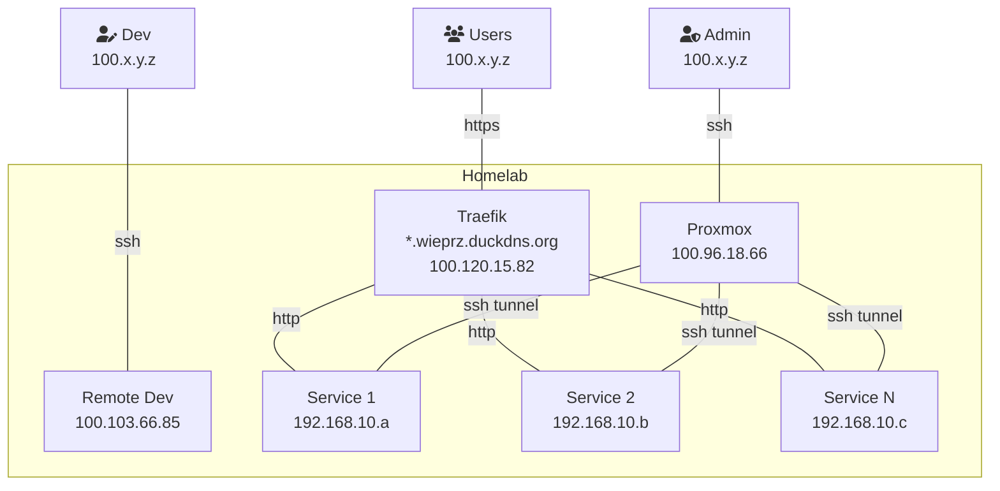
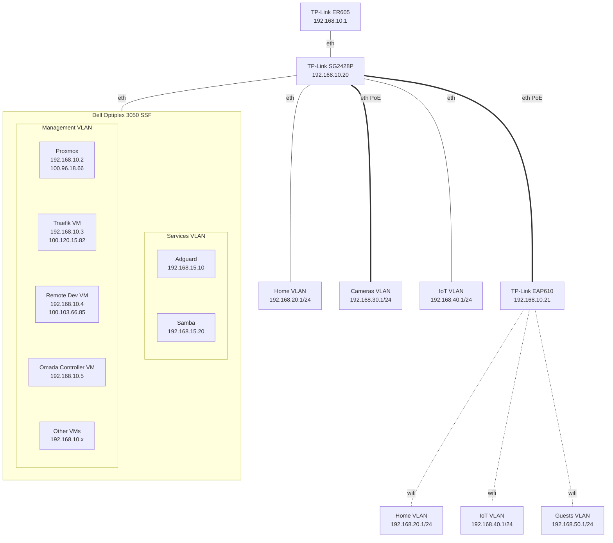

Welcome to the second part of my [homelab blog series](https://mkuthan.github.io/tags/#homelab).
In this installment, we'll delve into the intricacies of network configuration for homelab setup.
We'll cover topics such as securely accessing your homelab from the internet using VPN mesh, organizing your local network with VLANs, and implementing ACLs for enhanced security in the IoT era.

Let's get started 🚀

## VPN Mesh

Enabling remote access while you're away is an obvious step during homelab network setup. However, it’s crucial to do so securely to protect your network, data, and privacy.

* I want to ensure that I don't expose any ports to the internet, keeping my homelab hidden from unauthorized individuals.
* I prefer not to use a Virtual Private Server (VPS) as a gateway, as I want remote clients to connect directly to my homelab and maintain optimal speed.
* The configuration process should be simple and user-friendly, allowing anyone in my family to set up their devices without any hassle.
* The solution should incorporate the latest cryptographic techniques for enhanced security.

After some experimentation with [Cloudflare Tunnel](https://www.cloudflare.com/en-gb/products/tunnel/), I finally decided to use [Tailscale](https://tailscale.com/), a VPN mesh solution that simplifies remote access and network management.
It uses the [WireGuard](https://www.wireguard.com/) protocol, known for its speed and security.
Tailscale creates a decentralized mesh network called a [Tailnet](https://tailscale.com/kb/1136/tailnet), where nodes communicate directly, spreading the workload and minimizing latency.
The most amazing part is the ability to set up peer-to-peer communication despite firewalls or multi-level NAT (Network Address Translation).
I highly recommend reading an [article](https://tailscale.com/blog/how-nat-traversal-works) if you want to understand how NAT traversal works under the hood.

### Tailnet

Below you can find the VPN mesh topology of my Tailnet.
Tailscale assigns each node on my network a unique [100.x.y.z](https://tailscale.com/kb/1015/100.x-addresses) address.
This address stays stable for each device, which means it shouldn't change, no matter where the device moves to in the physical world.



### HTTPS access

I decided to use public DNS instead of [Tailscale MagicDNS](https://tailscale.com/kb/1081/magicdns), because I prefer open standards over vendor specific magic solutions.
The registered domain `wieprz.duckdns.org` can be resolved by anyone on the internet, but because Tailscale IP addresses are only accessible to users of my network, this is relatively harmless.

Users can access the homelab services through the [Traefik](https://traefik.io/traefik/) reverse proxy. The Traefik reverse proxy handles connections and routes traffic to services based on the domain name under the `*.wieprz.duckdns.org` wildcard. For example, requests to `a-name.wieprz.duckdns.org` are directed to the Home Assistant hosted at `192.168.10.a`, while requests to `b-name.wieprz.duckdns.org` are directed to the Vaultwarden hosted at `192.168.10.b`.

Additionally, Traefik manages SSL/TLS certificates from the [Let's Encrypt](https://letsencrypt.org) certification authority to ensure secure HTTPS connections.
Certificates are valid for 90 days but Traefik automatically renews them when needed.

### SSH Access

For SSH access I don't need a DNS record and reverse proxy like for HTTPS traffic.
All you need is a simple ssh client configuration in `~/.ssh/config` file.

```
Host proxmox
  Hostname 100.96.18.66

Host dev
  Hostname 100.103.66.85
  User marcin

Host *
  User root
  IdentityFile ~/.ssh/homelab_rsa
```

If I want to access other virtual machines in my homelab, I use an SSH tunnel through the `proxmox` host. I find this method to be sufficient, although an alternative option would be to install Tailscale on all my virtual machines.

```shell
ssh -L LOCAL_PORT:192.168.10.x:DESTINATION_PORT proxmox
```

I have also set up a virtual machine specifically for [VS Code remote development](https://code.visualstudio.com/docs/remote/remote-overview). This allows me to have a consistent development experience with full access to all devices connected to my homelab. Below you can see VS Code screen with a Terraform and Ansible IaaC (Infrastructure as a Code) project for my homelab.


## LAN

If you're already familiar with how I've configured access to my homelab from the internet, let's now focus on configuring the local network. There are four key hardware devices that play a role in this setup:

1. `TP-Link ER605` - This router serves as the entry point to the homelab
2. `TP-Link SG2428P` - This switch is connected to the router, and all other devices in the homelab are connected to this switch
3. `TP-Link EAP610` - This access point provides separate WiFi networks for Home, IoT, and Guests devices
4. `Dell Optiplex 3050 SSF` - This server hosts all the essential services for the homelab



### VLAN

VLANs, or Virtual Local Area Networks, are a powerful networking idea that allows you to logically separate devices into different networks, even if they're physically connected to the same switch. This provides several benefits:

* *Enhanced Security*: By isolating IoT devices in a separate VLAN, you can prevent them from accessing sensitive resources on your main network.
* *Improved Performance*: By isolating the camera traffic from other devices and applications, you can prevent congestion and optimize the performance.
* *Simplified Network Management*: With VLANs, you can logically group devices based on their function or location, making it easier to manage and troubleshoot your network.
* *Flexibility and Scalability*: VLANs provide the flexibility to add or remove devices from specific networks without physically rewiring your network infrastructure.

I defined 6 separate virtual local networks, known as VLANs, to achieve a balance between simplicity and security in my homelab setup.

| Network | Name | Description |
| ------- | ---- | ----------- |
| `192.168.10.x` | Management | Network devices: gateway, switch, access points. Core homelab services: Proxmox, Traefik, Omada software controller, Prometheus, Grafana, Loki, Home Assistant, Vaultwarden. |
| `192.168.15.x` | Services | Network for shared services, for example: Adguard DNS and Samba. All those services could be placed in the management VLAN but I need separated VLAN due to Omada access control list limitations. |
| `192.168.20.x` | Home | This network includes devices that are under my full control, such as computers and phones. |
| `192.168.30.x` | Cameras | Separated network for IP cameras only. |
| `192.168.40.x` | IoT | Network with all devices vulnerable to security issues or data leakage. |
| `192.168.50.x` | Guests | Dedicated network for my guests with rate limit. |

The screen from Omada controller with wired networks setup:


All networks have similar configurations, below you can see setup for *Home* VLAN:


The screen from Omada controller with wireless networks setup:


### ACL

One important aspect of VLANs is the ability to implement Access Control Lists (ACLs) to control the flow of traffic between different VLANs. ACLs allow you to define rules that decide which devices or networks are allowed to communicate with each other. By configuring ACLs, you can enforce strict security policies and prevent unauthorized access to sensitive resources.

By implementing ACLs for your VLANs, you can have fine-grained control over the network traffic within your homelab, ensuring that each device or network segment has the appropriate level of access and security.
Below is a matrix outlining the ACL definitions in my Homelab:

| Network | WAN | Management | Services | IoT | Other VLANs | Peers |
| ------- | :-: | :--------: | :------: | :-: | :---------: | :---: |
| Management | 🟢 | 🟢 | 🟢 | 🟢 | 🟢 | 🟢 |
| Services | 🟢 | 🟢 | 🟢 | 🚫 | 🚫 | 🟢 |
| Home | 🟢 | 🚫 | 🟢 | 🟢 | 🚫 | 🟢 |
| IoT | 🟢 | 🚫 | 🚫 | 🚫 | 🚫 | 🚫 |
| Cameras | 🚫 | 🚫 | 🚫 | 🚫 | 🚫 | 🚫 |
| Guests | 🟢 | 🚫 | 🚫 | 🚫 | 🚫 | 🚫 |

* **Management**: This network has full access to other networks and serves as the management network for my homelab.
* **Services**: Similar to the *Management* VLAN, this network provides a subset of services exposed to the *Home* VLAN, such as Adguard DNS or Samba.
* **Home**: Devices in this network have access to shared services, IoT devices for controlling my smart home, and can communicate with peers in the *Home* network for resource sharing.
* **IoT**: This network has restricted access to all other networks, including peers. This ensures that devices like my dishwasher can't control the heating in my house.
* **Cameras**: Devices in this network have restricted access to all other networks, including the WAN. The exception is that cameras can synchronize their time with selected NTP servers.
* **Guests**: This network only has access to the WAN, and traffic between peers in this network is limited.

Thanks to a well-designed VLAN setup, I only need 7 rules at the gateway level to define everything I need!


All networks have similar configurations, below you can see setup for *Home* VLAN:


I have also implemented Switch ACLs to control access between peers in the *Cameras*, *IoT*, and *Guests* networks. However, there is an exception for access to the network gateway. To achieve this, I have defined a pair of rules, one for incoming traffic and another for outgoing traffic. It's important to note that Switch ACLs are stateless, unlike Gateway ACLs which are stateful.


### mDNS

Multicast DNS (mDNS), is a protocol that allows devices on a network to discover and communicate with each other using domain names without the need for a centralized DNS server. It's commonly used for local network service discovery, such as finding printers, file servers, AirPlay, Google Cast, Spotify Connect or other services and devices.

Configuring mDNS across VLANs is a bit more complex because VLANs separate network traffic into different virtual networks. To enable mDNS across VLANs, you need to configure your network infrastructure to allow multicast traffic to pass between VLANs.

This involves setting up multicast routing or enabling protocols like IGMP snooping.
To expose all services from the *IoT* network to the *Management*, *Services*, and *Home* networks, you need to define a rule under the mDNS service in the Omada controller.


Ensure that you enable `IGMP Snooping` option for the *Management*, *Services*, and *Home* networks. This setup allows devices in the *Home* network to discover all services in the *IoT* network. For example, I can control music from my phone when it's playing on an Android TV connected to my [hi-fi stereo system](https://mkuthan.github.io/blog/2024/05/30/amplifier/).


## Stay tuned

In the next post, we’ll fire up our Proxmox hypervisor, spin up some virtual machines, and explore the software side of things. Spoiler alert: Home Assistant is waiting in the wings!


